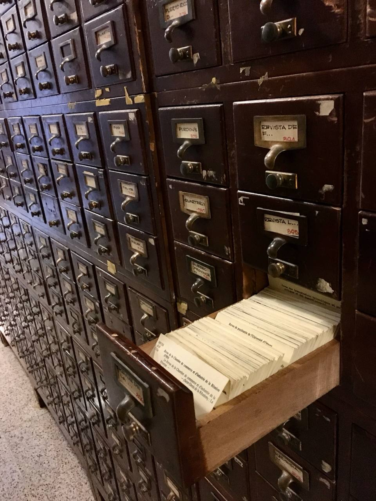

# DDS-RAG

Dewey Decimal System Retrieval Augmented Generation.



A RAG system that uses Dewey Decimal Classification (DDC) numbers as a hierarchical routing layer. All classification and metadata generation happens at **ingest time** — no LLM calls at query time.

## How It Works

```
Ingest:  Document → Summarize → Generate Metadata (DDC + tags) → Embed → Store
Query:   Query → Metadata Filter → Abstract Match → Vector Search → Rerank → Return
```

## Key Design

- **DDC numbers** narrow the search space before vector search (100K docs → ~200 in a branch)
- **Abstracts** provide fast pre-filtering within each branch
- **Metadata** (tags, topics, audience, format) enables flexible filtering
- **No per-query LLM calls** — only database indexes and vector math at query time

## Spec

See [SPEC.md](SPEC.md) for full architecture, API, and configuration details.
